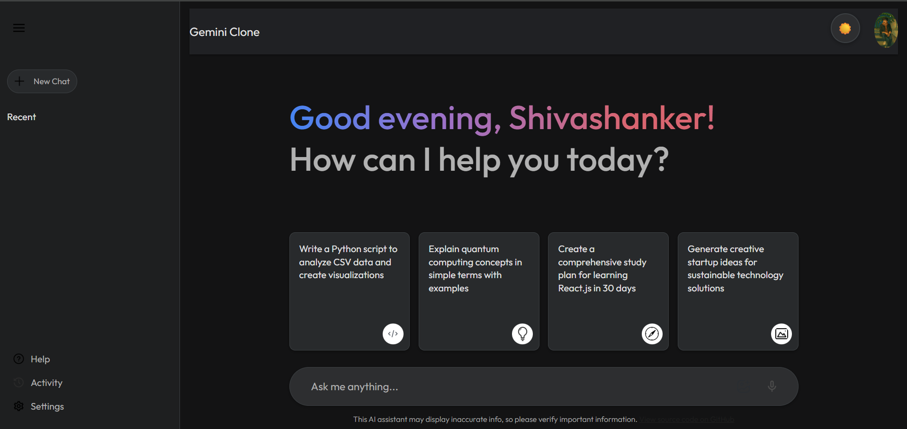
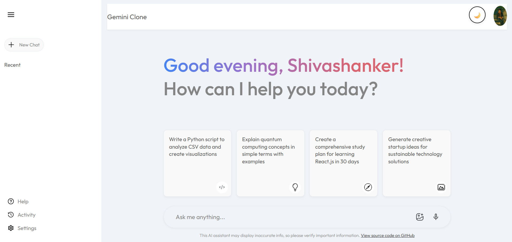

# My Gemini AI Clone

A modern, responsive Gemini AI interface built with React and Vite. This project demonstrates my full-stack development skills with a focus on AI integration and user experience.

## 🚀 Live Demo
[](https://your-app-name.netlify.app/)
[](https://github.com/shivas1432/my-gemini-clone)

## 📸 Demo Screenshots

### Light Mode


### Dark Mode


## ✨ Features

- **Clean UI/UX:** Modern, responsive design inspired by Google Gemini
- **Real-time AI Chat:** Integration with Google Gemini API
- **Fast Performance:** Built with Vite for optimal loading speeds
- **Mobile Responsive:** Works seamlessly on all devices
- **Type Safety:** Built with modern React patterns
- **Easy Deployment:** One-click Netlify deployment

## 🛠️ Technologies Used

- **Frontend:** React 18, Vite
- **AI Integration:** Google Generative AI
- **Styling:** Modern CSS with responsive design
- **Deployment:** Netlify
- **Development Tools:** ESLint, React DevTools

## 🚀 Getting Started

### Prerequisites
- Node.js (v18 or higher)
- npm or yarn
- Google Gemini API key

### Installation

1. **Clone the repository:**
   ```bash
   git clone https://github.com/shivas1432/my-gemini-clone.git
   cd my-gemini-clone
   ```

2. **Install dependencies:**
   ```bash
   npm install
   ```

3. **Set up environment variables:**
   ```bash
   # Create .env file
   VITE_GEMINI_API_KEY=your_api_key_here
   ```

4. **Start development server:**
   ```bash
   npm run dev
   ```

5. **Open in browser:**
   ```
   http://localhost:5173
   ```

## 🤝 Contributing

I welcome contributions from the community! Here's how you can help improve this project:

### Quick Start for Contributors

1. **Fork & Clone**
   ```bash
   git fork https://github.com/shivas1432/my-gemini-clone.git
   git clone https://github.com/your-username/my-gemini-clone.git
   cd my-gemini-clone
   ```

2. **Create Feature Branch**
   ```bash
   git checkout -b feature/your-feature-name
   ```

3. **Make Changes & Test**
   ```bash
   npm install
   npm run dev
   # Make your changes
   npm run build  # Test build
   ```

4. **Submit PR**
   ```bash
   git add .
   git commit -m "feat: your feature description"
   git push origin feature/your-feature-name
   ```

### What Can You Contribute?

- 🐛 **Bug Fixes:** Report and fix issues
- ✨ **New Features:** 
  - Dark/Light theme toggle
  - Chat history persistence
  - Voice input/output
  - Multi-language support
  - Export chat functionality
  - Real-time typing indicators
- 📚 **Documentation:** Improve guides and comments
- 🎨 **UI/UX:** Better animations, responsive design
- ⚡ **Performance:** Optimize loading times
- 🧪 **Testing:** Add unit/integration tests

### Contribution Guidelines

- **Code Style:** Follow ESLint configuration
- **Commit Messages:** Use conventional commits (feat:, fix:, docs:)
- **Testing:** Ensure changes don't break functionality
- **Documentation:** Update README for new features
- **Responsive:** Test on mobile and desktop
- **Browser Support:** Test on Chrome, Firefox, Safari

## 🐛 Reporting Issues

Found a bug? Please create an issue with:
- Steps to reproduce
- Expected vs actual behavior
- Browser/OS information
- Screenshots if applicable

## 💬 Get Help & Discuss

- **GitHub Issues:** For bugs and feature requests
- **GitHub Discussions:** For questions and ideas
- **Email:** shivashanker.dev@gmail.com
- **Telegram:** [@helpme_coder](https://t.me/helpme_coder)

## 📦 Deployment

### Netlify Deployment

1. **Connect GitHub repo to Netlify**
2. **Build settings:**
   - Build command: `npm run build`
   - Publish directory: `dist`
   - Node version: `18`

3. **Environment variables in Netlify:**
   ```
   VITE_GEMINI_API_KEY=your_api_key_here
   ```

### Manual Deployment
```bash
npm run build
# Upload dist/ folder to your hosting provider
```

## 🏗️ Project Structure

```
my-gemini-clone/
├── public/
│   ├── vite.svg
│   └── index.html
├── src/
│   ├── assets/
│   │   ├── screenshot.gif
│   │   └── ...
│   ├── components/
│   │   ├── Main/
│   │   ├── Sidebar/
│   │   └── ...
│   ├── config/
│   │   └── gemini.js
│   ├── context/
│   │   └── Context.jsx
│   ├── App.jsx
│   ├── index.css
│   └── main.jsx
├── .gitignore
├── package.json
├── vite.config.js
└── README.md
```

## 🔧 Configuration

### Environment Variables
Create a `.env` file in the root directory:
```env
VITE_GEMINI_API_KEY=your_google_gemini_api_key
```

### API Setup
1. Get your API key from [Google AI Studio](https://aistudio.google.com/app/apikey)
2. Add it to your `.env` file
3. Restart your development server

## 🎯 Roadmap

- [ ] Dark/Light theme toggle
- [ ] Chat history persistence
- [ ] Voice input/output
- [ ] Multi-language support
- [ ] Export chat functionality
- [ ] Real-time typing indicators
- [ ] File upload support
- [ ] Custom AI models integration

## 🤝 Code of Conduct

- Be respectful and constructive in discussions
- Help others learn and grow
- Focus on the code, not the person
- Welcome newcomers and different perspectives

## 📸 Screenshots

### Desktop View


### Mobile View


## 🔄 Version History

- **v1.0.0** - Initial release with basic Gemini AI integration
- **v0.1.0** - Project setup and basic UI components

## 👨‍💻 Author

**Kanugula Shivashanker**
- GitHub: [@shivas1432](https://github.com/shivas1432)
- LinkedIn: [shivashanker-kanugula](https://www.linkedin.com/in/shivashanker-kanugula-51a512252)
- Website: [shivashanker.com](https://www.shivashanker.com)
- Telegram: [@helpme_coder](https://t.me/helpme_coder)
- Instagram: [@ss_web_innovations](https://www.instagram.com/ss_web_innovations)

*Full-Stack Developer | React, Node.js, Express, MySQL | Passionate about building dynamic web apps | Continuous learner | Open to collaboration.*

## 🙏 Acknowledgments

- Google Gemini API for AI capabilities
- React team for the amazing framework
- Vite for the fast build tool
- Open source community for inspiration
- All contributors who help improve this project

## 📄 License

This project is open source and available under the [MIT License](LICENSE).

## 🌟 Show Your Support

If you found this project helpful, please:
- ⭐ Star the repository
- 🍴 Fork it to contribute
- 📢 Share it with others
- 🐛 Report issues
- 💡 Suggest improvements


---

**Happy Coding!** 🚀

*Built with ❤️ by Kanugula Shivashanker*
